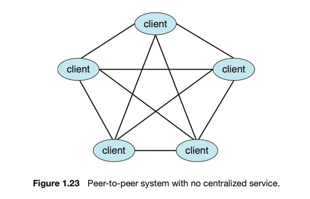
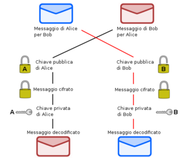
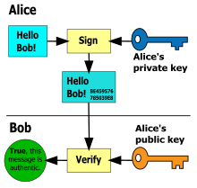

<< [Torna indietro all'indice](../README.md)

- [L'architettura decentralizzata peer-to-peer](#larchitettura-decentralizzata-peer-to-peer)
- [Pubblicazione e scrittura dei messaggi](#pubblicazione-e-scrittura-dei-messaggi)
- [Comunicazione tra _peer_ nella rete](#comunicazione-tra-peer-nella-rete)
  - [Messaggi privati cifrati](#messaggi-privati-cifrati)
  - [Canali pubblici con messaggi firmati](#canali-pubblici-con-messaggi-firmati)
- [Monitoraggio della rete](#monitoraggio-della-rete)

## L'architettura decentralizzata peer-to-peer
Il sistema di messaggistica che vogliamo realizzare comprende un'architettura di rete paritaria e un sistema software basato su servizi.
Come far coesistere questi due paradigmi?

I sistemi _peer-to-peer_ (_P2P_) prevedono la comunicazione tra nodi in una rete paritaria - dove tutte le entità sono pari tra loro.
Un nodo in una rete P2P viene detto _peer_ e si occupa contemporaneamente di offrire e richiedere servizi agli altri _peer_ della rete.

Un sistema software è implementato come un'architettura di servizi se ogni sua componente è un servizio. 
I servizi richiedono operazioni esposte da altri servizi attraverso delle opportune interfacce che identificano alcune informazioni importanti per la riuscita della comunicazione, quali ad esempio il nome dell'operazione, il tipo della richiesta e quello della risposta (in caso ce ne fosse una).

Per permettere ai _peer_ di scambiarsi messaggi abbiamo bisogno che ognuno di essi esponga una serie di operazioni per:
- registrarsi alla rete presso un altro _peer_ ed ottenere così un identificativo - uno _pseudonimo_
- scrivere un messaggio in un file locale 
- pubblicare un messaggio per un altro/altri _peer_

**ATTENZIONE - creare un sistema di persistenza dei messaggi (sia quelli privati che quelli pubblici) è un requisito obbligatorio per il progetto**, per maggiori informazioni sulle possibilità di abilitare la persistenza [leggere l'articolo di wikipedia (link alla versione italiana, anche se più completa quella inglese)](https://it.wikipedia.org/wiki/Persistenza_(informatica)).

### Peer-to-Peer Computing 
Il seguente estratto è preso dal libro di testo del corso "Operating System Concepts" di A. Silbershatz, Decima Edizione (in Inglese).
La traduzione è stata effettuata in automatico con il software [DeepL Translator](https://www.deepl.com/translator).

> Un'altra struttura per un sistema distribuito è il modello di sistema peer-to-peer (P2P). In questo modello, i client e i server non si distinguono l'uno dall'altro. Invece, tutti i nodi all'interno del sistema sono considerati peer, e ciascuno può agire sia come client che come server, a seconda che richieda o fornisca un servizio. I sistemi peer-to-peer offrono un vantaggio rispetto ai sistemi tradizionali client - server. In un sistema client - server, il server è un collo di bottiglia; ma in un sistema peer-to-peer, i servizi possono essere forniti da diversi nodi distribuiti in tutta la rete.

> Per partecipare ad un sistema peer-to-peer, un nodo deve prima entrare a far parte della rete di peer. Una volta che un nodo si è unito alla rete, può iniziare a fornire servizi ad altri nodi della rete e a richiedere servizi ad altri nodi della rete. La determinazione di quali servizi sono disponibili si realizza in uno dei due modi generali:

> - Quando un nodo entra in una rete, registra il suo servizio con un servizio di ricerca centralizzato sulla rete. Ogni nodo che desidera un servizio specifico contatta prima questo servizio di ricerca centralizzato per determinare quale nodo fornisce il servizio. Il resto della comunicazione avviene tra il cliente e il fornitore del servizio.

> - Uno schema alternativo non utilizza un servizio di ricerca centralizzato. Invece, un peer che agisce come cliente deve scoprire quale nodo fornisce il servizio desiderato trasmettendo una richiesta di servizio a tutti gli altri nodi della rete. Il nodo (o i nodi) che fornisce quel servizio risponde al peer che fa la richiesta. A supporto di questo approccio, deve essere previsto un protocollo di discovery che permetta ai peer di scoprire i servizi forniti da altri peer della rete. La Figura 1.23 illustra tale scenario.



> Le reti peer-to-peer hanno acquisito un'ampia popolarità alla fine degli anni '90 con diversi servizi di file sharing, come Napster e Gnutella, che hanno permesso ai peer di scambiarsi file tra loro. Il sistema Napster utilizzava un approccio simi- laro al primo tipo descritto sopra: un server centralizzato manteneva un indice di tutti i file memorizzati sui nodi peer nella rete Napster, e l'effettivo scambio di file avveniva tra i nodi peer. Il sistema Gnutella utilizzava una tecnica simile al secondo tipo: un client trasmetteva le richieste di file ad altri nodi del sistema, e i nodi che potevano servire la richiesta rispondevano direttamente al client. Le reti peer-to-peer possono essere utilizzate per scambiare in forma anonima i rials (ad esempio, la musica) protetti da copyright, e ci sono leggi che regolano la distribuzione di materiale protetto da copyright. In particolare, Napster ha avuto problemi legali per violazione del copyright e i suoi servizi sono stati chiusi nel 2001. Per questo motivo, il futuro dello scambio di file rimane incerto.

> Skype è un altro esempio di peer-to-peer computing. Esso consente ai clienti di effettuare chiamate vocali e videochiamate e di inviare messaggi di testo su Internet utilizzando una tecnologia nota come voice over IP (VoIP). Skype utilizza un approccio ibrido peer-to-peer. Comprende un server di login centralizzato, ma incorpora anche peers decentralizzati e permette a due peer di comunicare tra loro.

## Pubblicazione e scrittura dei messaggi
Implementare un sistema di messaggistica istantanea  tra nodi di una rete può essere affrontato in molti modi diversi.
Uno di questi modi - uno dei più interessanti nella nostra prospettiva "concorrente" - è quello di vedere il messaggio come una richiesta di scrittura su una risorsa condivisa da molti processi (ricorda niente?).

Il nostro caso particolare si può ricondurre ad un problema di gestione del sistema di **pubblicazione** e **scrittura** su file di un messaggio.
L'argomento è trattato in [questo _blog post_](https://spz.netlify.app/teaching/2020/05/12/appunti-jolie-publisher-writer), con particolare attenzione ai problemi che si possono incontrare nell'implementazione Jolie.

## Comunicazione tra _peer_ nella rete
I _peer_ comunicano in due modalità: si scambiano messaggi privati e pubblicano messaggi su canali - creati dagli stessi _peer_ - dove tutti possono scrivere.

Nella prima delle due modalità - quella che prevede uno scambio di messaggi tra _mittente_ e _destinatario_ - il sistema assicura che il messaggio non possa essere letto da terzi, criptando la comunicazione.
Nella seconda modalità - la scrittura su chat pubblica - il sistema garantisce sia l'identità del mittente che l'integrità del contenuto dei messaggi al momento della consegna.

### Messaggi privati cifrati
Alice e Bob vogliono comunicare - in privato - scambiandosi messaggi l'uno con l'altra, per farlo in sicurezza hanno deciso di usare un protocollo di crittografia asimmetrica:



1. Bob cripta il messaggio con la chiave pubblica di Alice;
2. Alice decripta il messaggio di Bob con la sua chiave Privata.

Ovviamente, nel caso in cui sia Alice a voler inviare un messaggio a Bob, ella eseguirà gli stessi passaggi di Bob, il quale invece farà come aveva fatto Alice.

### Canali pubblici con messaggi firmati
Alice ha bisogno di comunicare ad un gruppo di persone un qualche messaggio e decide di farlo apponendo una firma "digitale" al suo messaggio cosicchè tutto i destinatari possano controllare che nessun altro ha cambiato il contenuto di quello che Alice voleva comunicare e che è stata proprio lei, e non un altro, a scrivere il messaggio.



1. Alice crea una cosidetta impronta del suo messaggio, applicando una funzione di _hash_ ad esso e producendo una stringa
2. Alice cifra il risultato dell'hash con la sua chiave privata, il risultato dell codifica è la firma digitale di Alice per quel messaggio 
3. Alice allega la firma digitale al messaggio in chiaro e invia tutto ai suoi destinatari
4. Bob e chiunque altro riceva il messaggio, controlla che l'hash (lo stesso algoritmo di Alice) del messaggio in chiaro corrisponda con il risultato della decifratura della firma; quest'ultima fatta con la chiave pubblica di Alice.

## Monitoraggio della rete
L'ultimo componente - ma non per questo meno importante - del nostro sistema, è il _monitor_ di rete.
Esso si occupa di trascrivere (indifferentemente in un file oppure su console) il log di sistema.
Ogni operazione invocata nella rete deve, subito prima o subito dopo, inviare un messaggio di log al _monitor_.

La sua interfaccia dovrebbe apparire simile alla seguente:

```jolie
interface IMonitor {
    RequestResponse:
        log( string )( void )
}
```

Dove, per semplicità, il tipo della richiesta dell'operazioe `log` è una semplice stringa.
L'uso di una operazione di tipo `RequestResponse`, che implementa una comunicazione bloccante vuole forzare il "chiamante" di questa operazione ad attendere finchè il _monitor_ non ha ultimato la scrittura sulla coda dei _logs_.
L'esempio è a titolo puramente esemplificativo e non costituisce alcun obbligo nella scelta della soluzione pià appropriata per questo componente.
